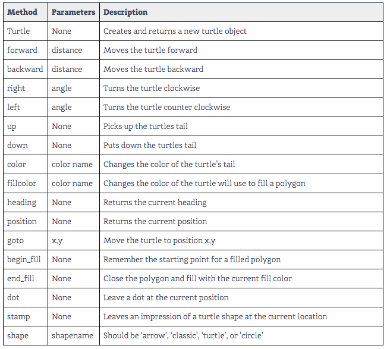

# Chapter 4 - Loops and Turtles

___
## LOOPS
___

### Repeating a task
Consider the following problem: 
**Print out all of the integers from 1 to 100**
One possible solution-
``` python
print (1)
print (2)
# ... and so on
```
This is tedious and not the way to do this.

## Loop Components
In order to repeat a task, we need two things:
1. The task that should be repeated (eg. 'Print a number')
2. The data set that shoudl be used with the task (eg. 'use 1...100')

### Lists
A list in Python is a data structure that allows us to collect several values in a  single variable or value.
Lists look like this:
``` python
[value1, value2, value3,..., valueN]
```
___
**NOTE:** A list holds multiple values, *HOWEVER* the list itself is a single value
___

List Examples:
``` python
[1, 2, 3, 4, 5]
["apple", "orange", "banana"]
#homogenius lists
[36, True, "eggs", 2.7]
#multiple value list
```

### Lists as types and values
We can store a list in a variable:
``` python
retired_nums = [1, 2, 6, 9, 10]
```
Lists define a new data type:
``` python
print(type(retired_nums))
```
**Output**
<type 'list'>

### For loops
A `for` loop allows us to repeat a section of code a specific number of times.
Each `for` loop has an iterator variable 

``` python
for name in ['Jesse', 'Sally', 'Zack', 'Chris']:
# /name/ is variable iterator     list      colon
    print(name)
    # loop body using variable iterator
```
___
**Note:** 
*Variable iterator*: takes on each value of the list, one at a time
*Loop body*: indeted and executed once per item in the list
___

*Examples*

``` python
some_numbers = [15, 16, 35, 98]
sum_of_numbers = 0
for number in some_numbers:
    sum_of_numbers = sum_of_numbers + number
    print(number)
    #indented defines the loop bosy

print("Sum:", sum_of_numbers)
#notice not indented. This shows the loop is over.
```

Ok - back to initial problem: 
**Print out all of the integers from 1 to 100**
``` python
print (1)
print (2)
# ... and so on
```
Still tedious with a loop
``` python
some_numbers = [1, 2, 3...]
```
### The `range` Function

The function `range(n)` will create a list of `n` integers from `0` to `n-1`
```python
print(range(5))
```
**Output** `[0, 1, 2, 3...]`
___
**NOTE:**
Python always prints from `0`
___

*Example*
```python
for number in range(50)
    print(number)
```
#### Using the `range` Function
To create more custom/complicated lists, use:
```python
range(start, stop, step)
```
* Start (your starting number)
* Stop (usually +/- 1 from the actual number)
* Step (how many by each step; can use -(number) to count backwards; can leave off step and just step by 1 default)
___
## TURTLES
___

A turtle is a visual queue that will draw patters on the screen based on commands given.
We'll use a Python **module** called `turtle` that will give us a nice way to build simple images using loops.

`import turtle` makes the `turtle` module available within our program

`sam = turtle.Turtle()` creates the turtle and names it

`sam.forward(150)` commands sam to move 150 px in the initial direction. 
___
**NOTE:** Turtles always start in the center facing right, unless you designate starting point
___
`sam.left(90)` turns the turtle 

`sam.forward(150)` moves sam again

... and on and on

---
**NOTE:** code repeats... 
* **D**on't
* **R**epeat
* **Y**ourself
___
since you are using the same turn should creat a loop with moving and turning.

```python
import turtle
zack = turtle.Turtle()
side_lenght = 50
for side in range(4)
    zack.forward(sidelenght)
    zack.left(90)
```




