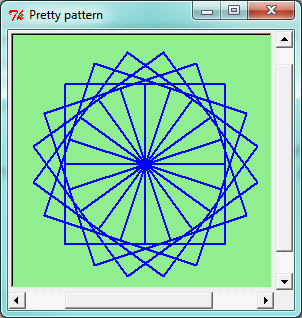
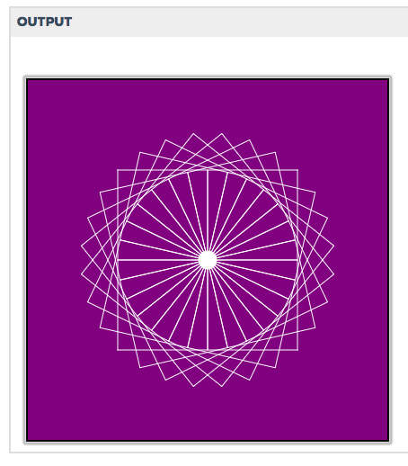
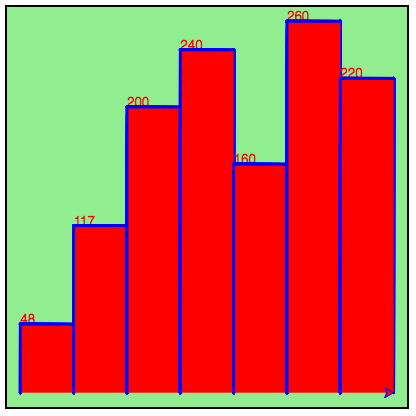

# Chapter 5 - Functions 

## Return value of a function
A function may containg a return statement, which can pass a value back to the code that called the function.
``` python
def hello_world(name):
    return "Hello ";
```
## Visualizing a function
parameter(s) --> function --> 

*Example*
``` python
import turtle

for i in range(4):
    a_turtle.forward(size)
    a_turtle.left(90)

speedy = turtle.Turtle()
#this drew a square by repeating a loop...
#instead of using the loop we can define the loop in a function...

def draw_square(a_turtle, size):
    for i in range(4):
    a_turtle.forward(size)
    a_turtle.left(90)

speedy = turtle.Turtle()
draw_square(speedy, 50)
#Now the function `draw_square` can be used over and over...
```
___
Activity:
``` python
#write a function that prints a number that adds two to a parameter
def add_two(num):
    print(num + 2)
#if you run it here it won't work as we haven't called the number
    
#modify the code so that it returns the result instead of printing. Call the function.

def add_two(num):
    return num + 2
    
add_two(2)   
#where is the result? we would need to print or add `result` to save.
print(add_two(2))
```
**Output**: `4`
Takeaway: Return values that are not caught in a result or print function will go away.

``` python
# add a line of code after your return statement

def add_two(num):
    return num + 2
    print("after return")
    
print(add_two(2))
```
**Output**: `4`

Takeaway:
If you put code after a return statement it will not execute

OR

after the return statement the function exits.

## Some More Questions
1. Does a function have to have parameters?
```python
def print_chris():
    print("Chris")
    
print_chris()
```
**OUTPUT**: `Chris`
``` python
def add(a, b):
    return (a + b)
print(add(2, 2))
```
**OUTPUT:** `4`
* you can have a function without parameters.
___

2. What happens if we call a function without providing a value for one or more input parameters?
``` python
def add(a, b):
    return (a + b)
print(add(2))
```
**Output**: `TypeError: add() takes exactly 2 arguments (1 given) on line 3`
* If you are missing a value for both the inputs, you will get a TypeError.
* If you only have one value, then make the second parameter =0.

___
3. Does a function have to return a value?
``` python
# "non-fruitful" function / has a "side-effect"
def print_chris():
    print("Chris")

# "fruitful" function    
def add(a, b):
    return (a + b)

print(add(2))
```
* No. A function that prints does not actually "return" a value. 
___
4. What happens if we have a function that doesn't return a value, but we try to store a return value in a variable?
``` python
# "non-fruitful" function / has a "side-effect"
def print_chris():
    print("Chris")
    
# "fruitful" function    
def add(a, b):
    return (a + b)

message = print_chris() 
# message has the "special value" of None (capital is special value in Py)
print(message)

none_value = None
```
* the default `return` value of a function is `None`.

If we state the value of the `return`, then it will `return` that value.
___
How to get multiple values... USE A LIST!
``` python
def compute(a, b):
    return [a + b, a*b]

results = compute(2, 3) # [5, 6]
print(results)
```
**Output:** `[5, 6]`

___
## SCOPE
All variables and parameters within a program have a scope. Their scope determines how they may be accessed and used.

*Ex*.
```python
def add_two(num):
    num = num + 2

add_two(2)
print(num)
```
**Output:** `NameError: name 'num' is not defined on line 5`

### Local Scope
Variables and parameters within a funciton have local scope. They may only be accessed within the function in which they are defined.
```python
def add_two(num):
    result = num + 2
    return result
```
`result` and `num` are both defined locally.

### Global Scope
Variables and parameters that *are not* defined within a function. They may be accessed from anywhaere within the given file or program.
``` python
num = 2
def print_num():
    print(num)

print_num()
```
* `num` is defined outside the function.
* global variables can be pulled into the function, however function variables cannot be used outside of the function.

### Shadowing
What happens when we use the same name for a global varialbe and a local variable?
```python
num = 2
def print_num(num):
    print(num)

print_num(3)
```
**Output:**  `3`

Why? because it is referring to the function variable, not the global... however:
``` python
num = 2
def print_num(num):
    print(num)

print_num(3)
print(num)
```
adding `print(num)` will call the `global` variable.

**Output:** `3`, `2`

___
## Chapter 5 studio


Draw this pretty picture...
```python
import turtle

def drawSquare(t, sz):
    """draw 4squares"""
    for i in range(4):
        alex.forward(100)
        alex.left(90)


def drawGrid(t, sz):
    """draw squares"""
    for i in range(4):
        drawSquare(alex, 100)
        alex.right(90)
        alex.forward(0)


def turnSquares(n):
    """turn the wheel"""
    for i in range(n):
        ang = 360/n
        drawGrid(alex, n)
        alex.right(ang)
        
        
alex = turtle.Turtle()
alex.color("white")
alex.shape("circle")
wn = turtle.Screen()
wn.bgcolor("purple")
alex.speed(0)

turnSquares(7)
```



# Exercises

11. 
```python
def sumTo(n):
    # your code here
    total_result = 0
    for num in range(n+1):
        total_result = total_result + num #can also write as 'total_result += num'
        
    return total_result

print(sumTo(7))
```
Accumulator pattern - adds on to your list each time you go through.


# Fun examples

```python
import turtle

def drawBar(t, height):
    """ Get turtle t to draw one bar, of height. """
    t.begin_fill()               # start filling this shape
    t.left(90)
    t.forward(height)
    t.write(str(height))
    t.right(90)
    t.forward(40)
    t.right(90)
    t.forward(height)
    t.left(90)
    t.end_fill()                 # stop filling this shape


xs = [48, 117, 200, 240, 160, 260, 220]  # here is the data
maxheight = max(xs)
numbars = len(xs)
border = 10

wn = turtle.Screen()             # Set up the window and its attributes
wn.setworldcoordinates(0-border, 0-border, 40*numbars+border, maxheight+border)
wn.bgcolor("lightgreen")

tess = turtle.Turtle()           # create tess and set some attributes
tess.color("blue")
tess.fillcolor("red")
tess.pensize(3)

for a in xs:
    drawBar(tess, a)

wn.exitonclick()
```



