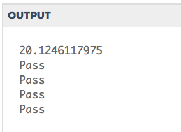

# Chapter 6
Exercises

6. Write a function findHypot. The function will be given the length of two sides of a right-angled triangle and it should return the length of the hypotenuse. (Hint: x ** 0.5 will return the square root, or use sqrt from the math module)
```python
from test import testEqual

import math

def findHypot(a,b):
    c = (a**2 + b**2) ** 0.5
    return c
    
print(findHypot(9.0, 18.0))

testEqual(findHypot(12.0, 5.0), 13.0)
testEqual(findHypot(14.0, 48.0), 50.0)
testEqual(findHypot(21.0, 72.0), 75.0)
testEqual(findHypot(1, 1.73205), 1.999999)
```


# CHAPTER 7


# CHAPTER 8
Exercises

2. Write a function that will return the number of digits in an integer
```python
def num_dig(n):
    n = str(n)
    l = len(n)
    return l

print(num_dig(34567))
```
*output*: `5`
```python
#answer code
def findNumDigits(n):
    n_str = str(n)
    return len(n_str)


print(findNumDigits(50))
print(findNumDigits(20000))
print(findNumDigits(1))
```
___
3. Write a function that removes all occurrences of a given letter from a string.
```python
from test import testEqual

def remove_letter(theLetter, theString):
    theString2 = theString.replace(theLetter, '')
    return theString2

testEqual(remove_letter('a', 'apple'), 'pple')
testEqual(remove_letter('a', 'banana'), 'bnn')
testEqual(remove_letter('z', 'banana'), 'banana')
```
*output*: `pass`
___
