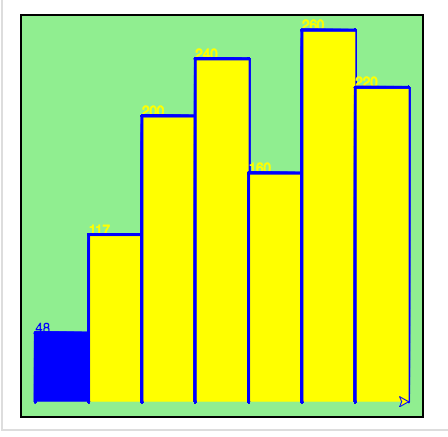

# Question snippets to go over with mentors...

### Chapter 6 exercises
4. Modify the turtle bar chart program from the previous chapter so that the bar for any value of 200 or more is filled with red, values between [100 and 200) are filled yellow, and bars representing values less than 100 are filled green.
```python
import turtle

def drawBar(t, height):
    """ Get turtle t to draw one bar, of height. """
    t.begin_fill()
    t.left(90)
    t.forward(height)
    t.write(str(height))
    t.right(90)
    t.forward(40)
    t.right(90)
    t.forward(height)
    t.left(90)
    t.end_fill()         
    if a in xs >= 200:
        return tess.fillcolor("yellow")
    else:
        return tess.fillcolor("green")

xs = [48, 117, 200, 240, 160, 260, 220]  # here is the data
maxheight = max(xs)
numbars = len(xs)
border = 10

wn = turtle.Screen()             # Set up the window and its attributes
wn.setworldcoordinates(0-border, 0-border, 40*numbars+border, maxheight+border)
wn.bgcolor("lightgreen")

tess = turtle.Turtle()           # create tess and set some attributes
tess.color("blue")
tess.pensize(3)

for a in xs:
    drawBar(tess, a)

wn.exitonclick()
```
My code which doesn't work

