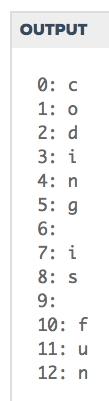

# 6. Sorted

## Walkthrough
Write a function `remove_char` that takes two string arguments, `a_str` and `a_char`. The first argument should be a string and the second should be a character (i.e. a string of length one). The function should return a new string, the result of which is `a_str` with each instance of `a_char` removed.

```python
from test import testEqual

def remove_char(a_str, a_char):

    #create new string
    new_str = ''
    
    # loop through and copy characters to new string
    
    for char in a_str:
        if char != a_char: 
        #this makes sure you only copy the chars NOT given
            new_str += char 
            #this is what copies the chars
    
    return new_str 
    #returns new string with copied chars

print(remove_char('donkey', 'k'))

testEqual(remove_char('aardvark', 'a'), 'rdvrk')
testEqual(remove_char('aardvark', 'k'), 'aardvar')
testEqual(remove_char('asdf', 'z'), 'asdf')
testEqual(remove_char('', 'a'), '')
```
### USING THE INDEX
```python
from test import testEqual

def remove_char(a_str, a_char):

    #create new string
    new_str = ''
    
    # loop through and copy characters to new string
    
    #for char in a_str:
    for idx in range(len(a_str)):
        
        #if char != a_char: 
        if a_str[idx] != a_char: 
        #this will pull each char out one at a time 
        #NOTE THIS IS THE INDEX OPERATOR NOT THE INDEX METHOD
        
            #new_str += char 
            new_str += a_str[idx]
    
    return new_str #returns new string with copied chars
    
print(remove_char('donkey', 'k'))
      
testEqual(remove_char('aardvark', 'a'), 'rdvrk')
testEqual(remove_char('aardvark', 'k'), 'aardvar')
testEqual(remove_char('asdf', 'z'), 'asdf')
testEqual(remove_char('', 'a'), '')
```
### Write a function that will use `idx` to print the location and the letter.
```python
def str_indexes(a_str):
    for idx in range(len(a_str)): #loops for length (len) of string
        print(str(idx) + ': ' + a_str[idx])
        
str_indexes('coding is fun')   
```

___

## Studio 
Since a string is just a sequence of characters, they can be sorted from least to greatest. Sorting can be hard so we’re just going to check if a string is sorted. Write a function which returns a boolean indicating if the string is sorted or not.

Here’s an example of how your function should behave. (Recall that the order operators are case-sensitive, so that `"A" < "a"` evaluates to `True`.)
```python
is_sorted("ABC") == True
is_sorted("aBc") == False
is_sorted("dog") == False
```
*Restate the problem*
* verify the string is sorted

*Break it down*
* verify = return Boolean
* sorted = lexicographically (caps are < lowercase)

*Figure our tools needed*
```python
# look left to right:
    #look at each pair
#1st 'A' < 'B' returns TRUE
#2nd 'B' < 'C' returns TRUE
#3rd NONE - only need a 2-loop 
def is_sorted(string):
    """Returns True if string is sorted from least to greatest
       False otherwise.
    """
    
    for idx in range(len(string)):
        
        if string[0] < string[1]:
            if string[1] < string[2]:
                return True
        else:
            return False

print(is_sorted('ABC'))
print(is_sorted('aBc'))
print(is_sorted('dog'))
print(is_sorted('Cat')) 
```  
*Key Questions*
* How many times should I loop?
* How to keep track or properly return the answer?
* Each time through the loop how do I get a pair of adjacent letters? (*HINT: use `idx`*)

Answer:
```python
def is_sorted(string):
  
    for i in range(len(string)-1):
        
        if not string[i] <= string[i+1]:
            return False
        else:
            return True
```

# 10. counting Characters

## Walkthrough

Write a “gradebook” program that takes grade data for a student and prints the resulting GPA. The output should look something like this:
``` python
Your grade (0.0-4.0): 4
# credits: 3
Enter another grade? [y/n]: y
Your grade (0.0-4.0): 4
# credits: 2
Enter another grade? [y/n]: n
Your GPA is: 4.0
```
to calculate gpa:
* GPA = QS/Total credits
* QS = sume of each credit * score

What to do ?

1. going to need to create a list to hold grades


# studio 1.11
## RECTANGLE

A rectangle has a length and a width. A rectangle should be able to provide its area and perimeter. A rectangle can indicate whether it is smaller than another rectangle in terms of area. A rectangle can indicate whether it is in fact a square.

first let's figure out what we need:
### rectangles need:
(should do this each time you are defining a class)

> Properties
* `length`: float
* `width`: float

> Methods
* `__init__(self, length, width)`
* `get_area()`
* `get_perimiter()`
* `is_smaller_than(Rectangle)`
* `is_square()`

### define the class:
```python
class Rectangle:

    def __init__(self, length, width):
        #building the object (constructor)—
        #initializing values to have values 
        #of what is passed in
        self.length = length 
        self.width = width

    def get_area(self):
        return self.length * self.width

    def get_perimeter(self):
        return 2 * (self.length + self.width)

    def is_square(self):
        return self.length == self.width

    def is_smaller(self, rectangle):
        area1 = self.get_area()
        area2 = rectangle.get_area()
        return area1 < area2

#extend class Rectangle to Square
class Square(Rectangle):
    
    def __init__(self, length):
        Rectangle.__init__(self, length, length)


rect1 = Rectangle(2, 2) 
#creating object called rect1 that is class Rectangle
print("Area: ", rect1.get_area()) 
#calls the object to run the get_area function
print("Perimeter: ", rect1.get_perimeter())
print("Is square: ", rect1.is_square())

rect2 = Rectangle(2, 3)
print(rect1.is_smaller_than(rect2))

square1 = Square(2)
square2 = Square(5)
print('square1 area', square1.get_area())
print(square1.is_smaller(square2))
```

*output:*

`Area:  4`

`Perimeter:  8`

`Is square:  True`

`True`

`square1 area 4`

`True`

___


## FRACTION
A fraction has a numerator and denominator. A fraction should be able to add itself to another fraction, returning a new fraction that represents the sum. A fraction should be able to multiply itself by another fraction, returning a new fraction as the product. A fraction should be able to take the reciprocal of itself, returning that value as a new fraction. A fraction should be able to simplify itself, returning a new fraction as that simplification.

### class needed:
> Fraction
### fractions need:
> properties
* `numerator`: float
* `denominator`: float

> methods
* `__init__(self, numerator, denominator)`
* `get_sum(self, Fraction)`
* `get_product(self, Fraction)`
* `get_value()`
* `get_simplify()`

```python
class Fraction:

    def __init__(self, top, bottom):
        
        self.numerator = top 
        self.denominator = bottom

    def __str__(self):
        return str(self.numerator) + '/' + str(self.denominator)

    def sum(self, other): #make sure you use variable different name then class
        new_denominator = self.denominator * other.denominator
        new_numerator = (self.numerator * other.denominator) + (self.denominator * other.numerator)
        return Fraction(new_numerator, new_denominator)
    
    def multiply(self, other):
        return
    
    def reciprocal(self):
        return Fraction(self.denominator, self.numerator)

    def simplify(self):
        return


    
half1 = Fraction(1, 2)
half2 = Fraction(2, 4)
print(half1)
print(half2)
print(half1.sum(half2))
```
*output:*

`1/2`

`2/4`

`8/8`


## BASEBALLPLAYER

A baseball player has a name and a jersey number. Most players hit either right or left, but some can hit either way. This object should be able to react when a player completes a game, recording how many hits and RBIs the player earned in that game. A player has a certain number of runs and RBIs he or she has recorded over all games played. A player has a certain number of games he or she has played.

```python
class BaseballPlayer:
    
    games_played = 0 #can put these here or below in __init__ as... 
    hits = 0
    rbis = 0
    runs = 0
       
    def __init__(self, name, jersey_number, batting_stance): #(..., games_played=0)
        
        self.name = name
        self.jersey_number = jersey_number
        self.batting_stance = batting_stance
        #self.games_played = games.played
        
        
    def __str__(self):
        #include name, jersey_number, rbis
        return self.name + '(' + str(self.jersey_number) + ') - ' + str(self.rbis) + ' RBIs'
    
    
    def print_stats(self):
        print('Hits: ', self.hits)
        print('RBIS=s: ', self.rbis)
        print('Runs: ', self.runs)
        print('Games played: ', self.games_played)
    
    def complete_game(self, rbis, runs, hits):

        self.rbis += rbis
        self.runs += runs
        self.hits += hits
        self.games_played += 1
        
        
ozzie = BaseballPlayer('Ozzie Smith', 1, 'switch')
ozzie.complete_game(1, 2, 1)
ozzie.complete_game(0, 3, 1)

print(ozzie)
ozzie.print_stats()
```
*output:*

`Ozzie Smith(1) - 1 RBIs`

`Hits:  2`

`RBIS=s:  1`

`Runs:  5`

`Games played:  2`


